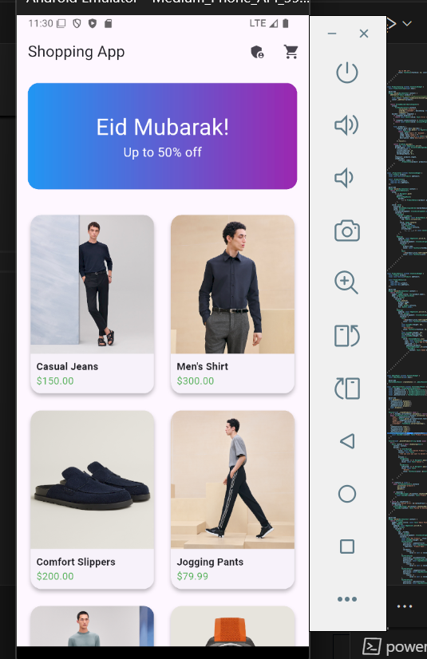
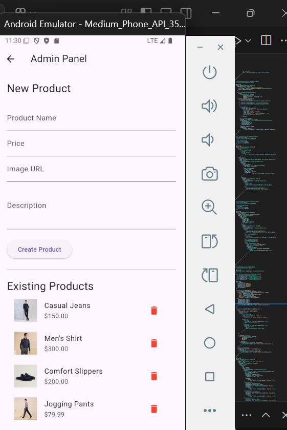
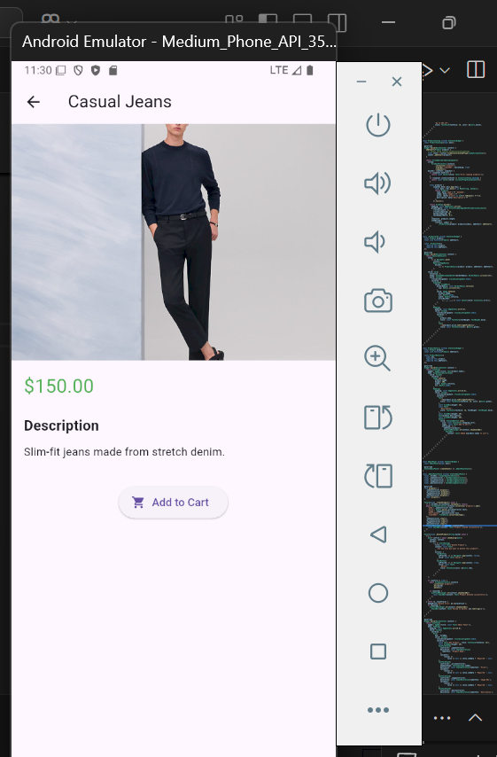
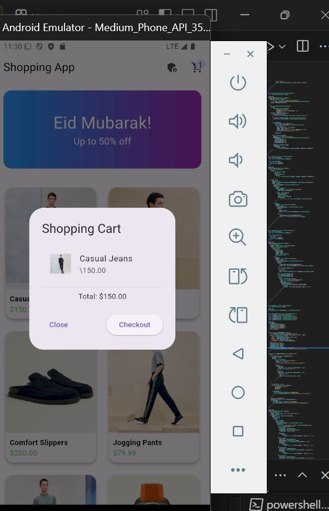
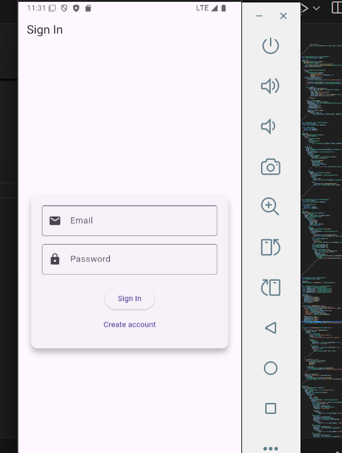

# 🛍️ Shopping App

A Flutter-based online shopping app with Firebase Firestore integration for product management. Browse products, view details, manage a cart, and use the admin panel to add or delete products — all in a clean Material Design UI.

## Features

| Feature | Description |
|---|---|
| **Sign In / Register** | Email/password authentication via Firebase Auth |
| **Home Screen** | Promotional banner + product grid |
| **Product Catalog** | Live products fetched from Firestore |
| **Product Details** | Image, price, description, and add-to-cart |
| **Shopping Cart** | Add items, view total, checkout with confirmation |
| **Admin Panel** | Create and delete products via Firestore |
| **Firebase Integration** | Real-time Firestore database |

## Screenshots

| | | |
|:---:|:---:|:---:|
|  |  |  |
|  |  | |

## Screens

- **Sign In** — Entry point with email/password form and "Create account" link
- **Home** — Gradient promo banner + scrollable 2-column product grid
- **Product Details** — Full product view with image, description, and "Add to Cart"
- **Cart** — Lists selected products, displays total, confirms purchase
- **Admin Panel** — Form to add products + list of existing products with delete capability

## Tech Stack

- **Framework:** Flutter & Dart
- **Backend:** Firebase Firestore (real-time database)
- **State Management:** `setState`
- **UI:** Material Design

## Getting Started

### Prerequisites

- Flutter SDK (^3.7.2)
- A Firebase project (Firestore must be seeded with a `products` collection)

### Setup

1. Clone the repo and navigate to the project directory:

   ```sh
   cd shopping_app
   ```

2. Install dependencies:

   ```sh
   flutter pub get
   ```

3. The Firebase configuration is already included in `lib/firebase_options.dart`. Ensure your `products` collection in Firestore has documents with the following fields:

   | Field | Type | Description |
   |---|---|---|
   | `name` | string | Product name |
   | `price` | number | Product price |
   | `image` | string | Product image URL |
   | `description` | string | Product description |
   | `createdAt` | timestamp | Sort order (auto-set by admin panel) |

4. Run the app:

   ```sh
   flutter run
   ```

## Connecting Your Own Firebase Backend

The app is already wired to use Firebase — you just need to point it at a Firestore database with product data.

### 1. Create a Firebase project

Go to the [Firebase Console](https://console.firebase.google.com/), create a project (or reuse an existing one), and enable **Cloud Firestore**.

### 2. Register your app

In Firebase Console → Project Settings → General → **Add app**, choose the platforms you want (Android, iOS, Web, Windows, macOS). Firebase will generate config values for each.

### 3. Replace the config

Open `lib/firebase_options.dart` and update the `apiKey`, `appId`, `projectId`, etc. for each platform with the values from your Firebase project. Alternatively, re-run the FlutterFire CLI:

```sh
dart pub global activate flutterfire_cli
flutterfire configure --project=<your-project-id>
```

This regenerates `firebase_options.dart` automatically.

### 4. Enable App Check (recommended)

In Firebase Console → App Check → **Register app** for each platform. App Check verifies that requests to your Firebase resources come from your genuine app, preventing API abuse even if the API keys are extracted.

The app already includes `FirebaseAppCheck.instance.activate()` in `main.dart`. You just need to register your app in the Firebase Console and choose a provider (DeviceCheck for iOS, Play Integrity for Android, reCAPTCHA for web).

### 5. Enable Firestore

In Firebase Console → Firestore → **Create database**. Start in test mode for development, then apply proper security rules before going live.

> **Security warning:** Do not leave Firestore in test mode on a production app. Anyone with your API key can read/write all data. Below is a minimal set of rules to allow only authenticated users to read products and restrict writes to the admin:

```firestore
rules_version = '2';
service cloud.firestore {
  match /databases/{database}/documents {
    match /products/{product} {
      allow read: if request.auth != null;
      allow write: if request.auth != null;
    }
  }
}
```

### 6. Seed product data

Add a collection named `products` with one or more documents. Each document needs these fields:

| Field | Type | Example |
|---|---|---|
| `name` | `string` | "Casual Sneakers" |
| `price` | `number` | 49.99 |
| `image` | `string` | `https://example.com/shoe.jpg` |
| `description` | `string` | "Comfortable everyday sneakers." |
| `createdAt` | `timestamp` | _(auto-set by the admin panel)_ |

You can either:

- Use the in-app **Admin Panel** (tap the admin icon in the app bar) to add products via the UI, or
- Add documents manually in the Firebase Console → Firestore → **Start collection**.

## Project Structure

```
lib/
├── firebase_options.dart   # Firebase config per platform
└── main.dart               # All screens & widgets (single file)
```

## Notes

- The test file contains a basic smoke test for the sign-in page. Full widget tests require mocking Firebase.
